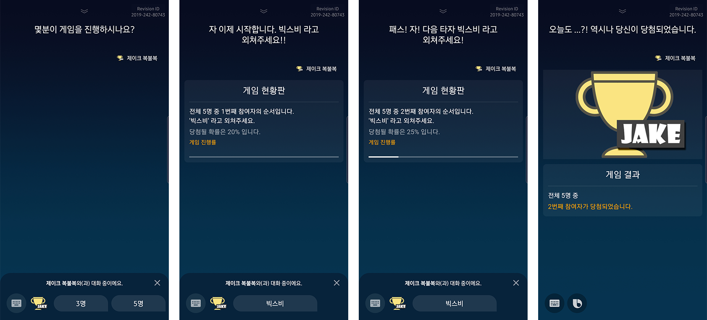

#  누가쏴

  
  
  

"누가쏴는 언제 어디서 누구나 간편하게 즐길 수 있는 복불복 게임 캡슐입니다."

### 대표발화

> 1. "누가쏴에서 복불복 게임 시작"
> 2. "누가쏴에서 5인용 복불복 게임 시작"
> 3. "누가쏴에서 선택 게임 시작"

### 대표 시나리오
> 사용자 1 : "누가쏴에서 복불복 게임 시작"
> 빅스비   : "몇분이 게임을 진행하시나요?"
> 사용자 1 : "5명"
> 빅스비   : "자 이제 시작합니다. 빅스비 라고 외쳐주세요."
> 사용자 1 : "빅스비"
> 빅스비   : "패스! 2번째 도전자입니다. 빅스비!"
> 사용자 2 : "빅뱅"
> 빅스비   : "빅스비라고 외치지 않았습니다. 빅! 스! 비! 라고 외쳐주세요!!"
> 사용자 2 : "빅스비"
> 빅스비   : "패스! 현재 총 5분이 복불복에 참여중 입니다. 빅스비 라고 외쳐주세요!"
> 사용자 3 : "빅스비"
> 빅스비   : "당첨되었습니다. 한결같은 당신이 있어 우리가 행복합니다." (결국 너야~ 내 심장이 기억하는 사람)

### 동작 순서

#### STEP 1. 실행
> 대표발화 "누가쏴에서 복불복 게임 시작" 을 외치면 빅스비가 "몇분이 게임을 진행하시나요?" 라고 묻게됩니다.
> 그 이유는 [StartChooser](./models/actions/StartChooser.model.bxb)가 [CreateChooser](./models/actions/CreateChooser.model.bxb) 통해 Chooser를 생성하는데, Chooser의 NumPlayer가 없기 때문입니다.
> 따라서 NumPlayer를 추가하기 위해 [CreateChooser.view.bxb](./resources/base/views/CreateChooser.view.bxb)를 활용해 질문을 하게 됩니다.
> 단, "누가쏴에서 5인용 복불복 게임 시작" 처럼 외치면 5명이 NumPlayer에 적용되어 바로 게임이 시작됩니다.

###### 그림으로 STEP 1.의 동작 Flow를 보면 아래와 같습니다.

#### STEP 2. 최초 사용자 선택 진행
> STEP 1에서 n명 이라고 발화를 하거나, "누가쏴에서 n인용 복불복 게임 시작" 을 발화하면, STEP 2로 진입합니다.
> STEP 2는 최초로 사용자를 선택하는 것으로, 빅스비가 "자 이제 시작합니다. 빅스비 라고 외쳐주세요." 라고 이야기합니다.
> 그 이유는 [StartChooser](./models/actions/StartChooser.model.bxb)가 선택된 사용자가 없을 때 [ChoosePlayer](./models/actions/ChoosePlayer.model.bxb)로 이동되며
> ChoosePlayer는 PlayerAction을 필요로 하기 때문입니다.
> 따라서 PlayerAction을 추가하기 위해 [ChoosePlayer.view.bxb](./resources/base/views/ChoosePlayer.view.bxb)를 활용해 질문을 하게 됩니다.

###### 그림으로 STEP 2.의 동작 Flow를 보면 아래와 같습니다.

#### STEP 3. 사용자 '빅스비' 발화 후 패스 (당첨되지 않음)
> STEP 2에서 사용자가 '빅스비' 라고 외쳤을 때 [ChoosePlayer.js](./code/ChoosePlayer.js)의 알고리즘을 기반으로 패스 여부를 결정합니다.
> STEP 3은 알고리즘 결과 패스한 경우 입니다. 패스 했을 경우 ChoosePlayer 함수는 currentPlayer를 1 증가시키고 Chooser를 리턴합니다.
> 리턴된 Chooser는 다시 StartChooser의 입력이 되고, ChoosePlayer가 다시 시작되어,
> STEP 2 처럼 PlayerAction을 추가하기 위해 "빅스비 라고 외쳐주세요" 라고 요청 받게됩니다.

###### 그림으로 STEP 3.의 동작 Flow를 보면 아래와 같습니다.

#### STEP 4. 사용자 '빅스비' 발화 후 벌칙 당첨 (당첨됨)
> STEP 2 또는 STEP 3에서 사용자가 '빅스비' 라고 외쳤을 때 [ChoosePlayer.js](./code/ChoosePlayer.js)의 알고리즘 결과 당첨된 경우입니다.
> 당첨된 경우 Chooser의 isSelected가 true로 설정되며, StartChooser를 거쳐 [PlayChooserSong](./models/actions/PlayChooserSong.model.bxb)으로 이동하게 됩니다.
> PlayChooserSong은 audio 라이브러리를 활용해 노래를 재생하고 [EndChooser.view.bxb](./resources/base/views/EndChooser.view.bxb) 형태로 그림을 그립니다.

###### 그림으로 STEP 4.의 동작 Flow를 보면 아래와 같습니다.

###### 그림으로 STEP 1 ~ STEP 4의 진행을 확인해보면 아래와 같습니다.

